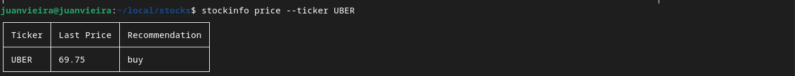

# Stocks Info


This command line application shows you the Price, Recommendation and News about a stock. Here are some sample terminal outputs below:

**News**


**Price**



To extract data, I used requests from this API: https://rapidapi.com/sparior/api/yahoo-finance15

Note: The stock recommendation data is not a recommendation from my part. I am not an investment analyst, I am a golang developer.

## How to use

Clone this repo (SSH is recommended):
```bash
git clone https://github.com/ju4nv1e1r4/stocks-on-go.git
```

Compile the main code:
```bash
go build -o choose-a-name-for-your-costum-command main.go
```

Add your dir to PATH:
```bash
export PATH=$PATH:path/to/your/dir
```

To see prices:
```bash
your-costum-command price --ticker <Stock Ticker>
```

To find Servers:
```bash
your-costum-command news --ticker <Stock Ticker>
```

This project is part of my learning in Golang. Over time, I will add improvements.